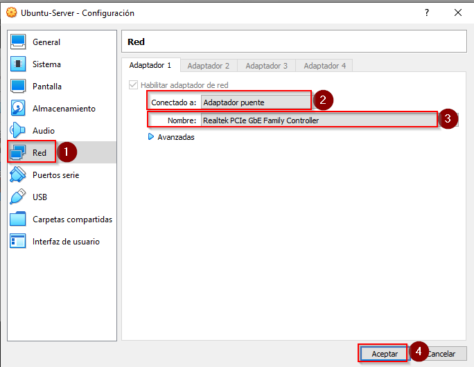

<center>

# Keycloak en servidor dedicado

</center>
Explicación para poder crear un servidor dedicado en el cual se monta un keycloak al cual se podrá acceder desde una aplicación desarrollada con Spring y Angular y otra desarrollada en Android. Para centralizar el inicio de sesión de los usuarios.

## Alta del servidor dedicado
Primero es necesario crear una VM, en este caso se hace utilizando [Virtual Box](https://www.virtualbox.org/wiki/Downloads "Virtual Box Dowmload") con [Ubuntu](https://ubuntu.com/download/server "Ubuntu Download").

Una vez dado de alta el servidor e iniciado sesión desde la consola ingresamos los siguientes comandos:

*Otorga permisos root al usuario:*
```console
sudo su
```

*Actualiza el software:*
```console
apt-get update
```

*Instalacion de apache:*
```console
apt-get install apache2
```

*Ir al directorio del sv para ver el index.html*
```console
cd /var/www/html 
```

*ver el listado de archivos dentro del directorio*
```console
dir
```
Conectar el adaptador de red en VirtualBox, desde la configuración de la VM.



*Ver la configuración de red del servidor*
```console
ifconfig
```
En la línea "Direc. inet" se puede visualizar la IP del sv creado y acceder al mismo mediante un navegador. 

## Descargar y ejecutar Keycloak en el servidor. 
Para poner en producción keycloak primero es necesario actualizar el software e instalar Java JDK 11. Para esto ponemos lo siguiente en consola:

### Actualizar software
```console
apt-get update -y
apt-get upgrade -y
```

### Instalar Java
```console
apt-get install default-jdk -y
```

*Una vez instalado se puede verificar la versión:*
```console
java --version
```

### Descargar e instalar Keycloak
*Para comenzar la descarga:*
```console
wget https://github.com/keycloak/keycloak/releases/download/15.0.2/keycloak-15.0.2.tar.gz
```

*Extraer el archivo de la descarga*
```console
tar -xvzf keycloak-15.0.2.tar.gz
```

*Mover el directo extraído a /opt*
```console
mv keycloak-15.0.2 /opt/keycloak
```

*Crar usuario y grupo dedicado para keycloak*
```console
groupadd keycloak
useradd -r -g keycloak -d /opt/keycloak -s /sbin/nologin keycloak
```

*Establecer la propiedad del directorio del directorio /opt/keycloak en keycloak:*
```console
chown -R keycloak: /opt/keycloak
chmod o+x /opt/keycloak/bin/
```
### Configurar Keycloak
*Crear directorio de configuración y copiar el archivo de muestra*
```console
mkdir /etc/keycloak
cp /opt/keycloak/docs/contrib/scripts/systemd/wildfly.conf /etc/keycloak/keycloak.conf
cp /opt/keycloak/docs/contrib/scripts/systemd/launch.sh /opt/keycloak/bin/
```

*Establecer la propiedad adecuada y editar el launch.sh*
```console
chown keycloak: /opt/keycloak/bin/launch.sh
nano /opt/keycloak/bin/launch.sh
```

*De la siguiente manera: (Al finalizar guardar y cerrar el editor, manteniendo los cambios realizador)*
```console
#!/bin/bash

if [ "x$WILDFLY_HOME" = "x" ]; then
WILDFLY_HOME="/opt/keycloak"
fi

if [[ "$1" == "domain" ]]; then
$WILDFLY_HOME/bin/domain.sh -c $2 -b $3
else
$WILDFLY_HOME/bin/standalone.sh -c $2 -b $3
fi
```

*Crear y editar un archivo .md: (en este caso se copia uno previo, pero puede ser crearo de cero)*
```console
cp /opt/keycloak/docs/contrib/scripts/systemd/wildfly.service /etc/systemd/system/keycloak.service
nano /etc/systemd/system/keycloak.service
```

*Editar de la siguiente manera:*
```console
[Unit]
Description=The Keycloak Server
After=syslog.target network.target
Before=httpd.service
[Service]
Environment=LAUNCH_JBOSS_IN_BACKGROUND=1
EnvironmentFile=/etc/keycloak/keycloak.conf
User=keycloak
Group=keycloak
LimitNOFILE=102642
PIDFile=/var/run/keycloak/keycloak.pid
ExecStart=/opt/keycloak/bin/launch.sh $WILDFLY_MODE $WILDFLY_CONFIG $WILDFLY_BIND
StandardOutput=null
[Install]
WantedBy=multi-user.target
```

*Volver a cagar, iniciar y habilitar el daemon:*
```console
systemctl daemon-reload
systemctl start keycloak
systemctl enable keycloak
```

*Verificar el estado de keycloak*
```console
systemctl status keycloak
```

### Crear usuario de admin en keycloak auth

*Crear el usuario y configurar contraseña*
```console
/opt/keycloak/bin/add-user-keycloak.sh -u admin
```
*Configuración:*
```console
Press ctrl-d (Unix) or ctrl-z (Windows) to exit
Password:
Added 'admin' to 'https://net.cloudinfrastructureservices.co.uk/opt/keycloak/standalone/configuration/keycloak-add-user.json', restart server to load user
```

*Reiniciar Keycloak*
```console
systemctl restart keycloak
```

*Deshabilitar HTTPS para keycloak*
```console
/opt/keycloak/bin/kcadm.sh config credentials --server http://your-server-ip:8080/auth --realm master --user admin
# Ingresar contraseña
/opt/keycloak/bin/kcadm.sh update realms/master -s sslRequired=NONE
```

Ahora se podrá acceder al Administrador de Keycloak (http://{IP-SERVIDOR}:8080/auth/admin).


